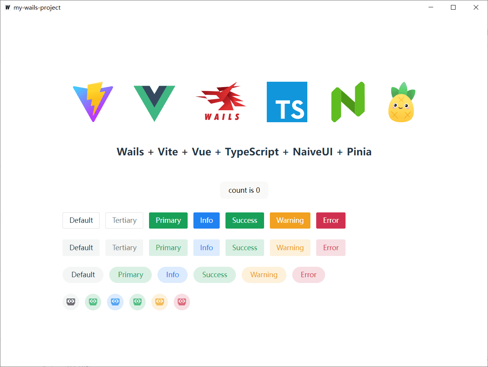

# README

## About

A template for Wails with Vite + Vue + TypeScript + NavieUI + Pinia.

## How to use?

1. Clone the repository:
```
git clone https://github.com/id88/wails-vite-vue-ts-navie-pinia.git
```

2. Initialize your Wails project:
```
wails init -n my-wails-project -t wails-vite-vue-ts-navie-pinia
```
After running the command, Wails will create a folder named my-wails-project in the current directory and initialize the new project within that folder.
- `wails init`: Initializes a new Wails project.
- `-n my-wails-project`: Specifies the name of the new project (in this case, "my-wails-project").
- `-t wails-vite-vue-ts-navie-pinia`: Specifies the template to use for the project.


3. Change into the project directory:
```
cd my-wails-project
```

4. Run the development environment:
```
wails dev
```




## Live Development

To run in live development mode, run `wails dev` in the project directory. In another terminal, go into the `frontend`
directory and run `npm run dev`. The frontend dev server will run on http://localhost:34115. Connect to this in your
browser and connect to your application.

## Building

To build a redistributable, production mode package, use `wails build`.
